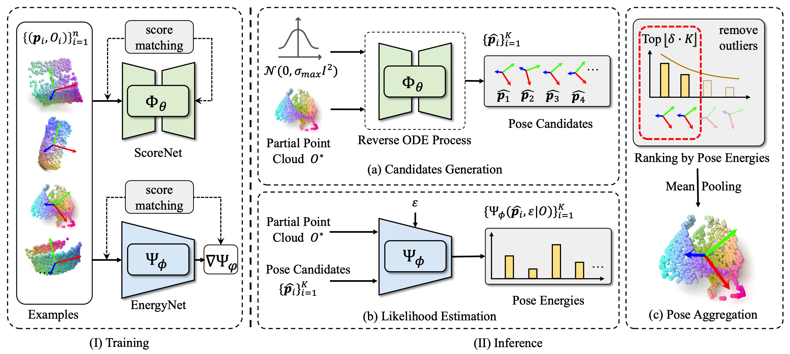

# GenPose: Generative Category-level Object Pose Estimation via Diffusion Models


[](https://sites.google.com/view/genpose)
[](https://arxiv.org/pdf/2306.10531.pdf)
[](https://hits.seeyoufarm.com)
[](https://github.com/Jiyao06/GenPose/blob/main/LICENSE)
[](https://paperswithcode.com/sota/6d-pose-estimation-using-rgbd-on-real275?p=genpose-generative-category-level-object-pose)

The official Pytorch implementation of the NeurIPS 2023 paper, [GenPose](https://arxiv.org/pdf/2306.10531.pdf).

## Overview



**(I)** A score-based diffusion model and an energy-based diffusion model is trained via denoising score-matching. 
**(II)** a) We first generate pose candidates from the score-based model and then b) compute the pose energies for candidates via the energy-based model. 
c) Finally, we rank the candidates with the energies and then filter out low-ranking candidates. 
The remaining candidates are aggregated into the final output by mean-pooling.

Contents of this repo are as follows:
<!-- - [GenPose: Generative Category-level Object Pose Estimation via Diffusion Models](#genpose--generative-category-level-object-pose-estimation-via-diffusion-models) -->
* [Overview](#overview)
* [TODO](#todo)
* [Requirements](#requirements)
* [Installation](#installation)
  + [Install pytorch](#install-pytorch)
  + [Install pytorch3d from a local clone](#install-pytorch3d-from-a-local-clone)
  + [Install from requirements.txt](#install-from-requirementstxt)
  + [Compile pointnet2](#compile-pointnet2)
* [Download dataset and models](#download-dataset-and-models)
* [Training](#training)
  + [Score network](#score-network)
  + [Energy network](#energy-network)
* [Evaluation](#evaluation)
  + [Evaluate on REAL275 dataset.](#evaluate-on-real275-dataset)
  + [Evaluate on CAMERA dataset.](#evaluate-on-camera-dataset)
* [Citation](#citation)
* [Contact](#contact)
* [License](#license)

## TODO
- Release the code for object pose tracking.
- Release the preprocessed testing data for object pose tracking.

## Requirements
- Ubuntu 20.04
- Python 3.8.15
- Pytorch 1.12.0
- Pytorch3d 0.7.2
- CUDA 11.3
- 1 * NVIDIA RTX 3090

## Installation

- ### Install pytorch
``` bash
pip install torch==1.12.0+cu113 torchvision==0.13.0+cu113 torchaudio==0.12.0 --extra-index-url https://download.pytorch.org/whl/cu113
```


- ### Install pytorch3d from a local clone
``` bash
git clone https://github.com/facebookresearch/pytorch3d.git
cd pytorch3d
git checkout -f v0.7.2
pip install -e .
```

- ### Install from requirements.txt
``` bash
pip install -r requirements.txt 
```

- ### Compile pointnet2
``` bash
cd networks/pts_encoder/pointnet2_utils/pointnet2
python setup.py install
```

## Download dataset and models
- Download camera_train, camera_val, real_train, real_test, ground-truth annotations and mesh models provided by <a href ="https://github.com/hughw19/NOCS_CVPR2019">NOCS</a>. Unzip and organize these files in $ROOT/data as follows:
``` bash
data
├── CAMERA
│   ├── train
│   └── val
├── Real
│   ├── train
│   └── test
├── gts
│   ├── val
│   └── real_test
└── obj_models
    ├── train
    ├── val
    ├── real_train
    └── real_test
```

- Preprocess NOCS files following <a  href ="https://github.com/mentian/object-deformnet">SPD</a>. 

We provide the preprocessed testing data (REAL275) and checkpoints <a href="https://drive.google.com/file/d/1UrSVb7qYIOGWSB4z6W8IrBdRm-8M0Q-N/view?usp=sharing">here</a> for a quick evaluation. Download and organize the files in $ROOT/results as follows:
``` bash
results
├── ckpts
│   ├── EnergyNet
│   │   └── ckpt_genpose.pth
│   └── ScoreNet
│       └── ckpt_genpose.pth
├── evaluation_results
│   ├── segmentation_logs_real_test.txt
│   └── segmentation_results_real_test.pkl
└── mrcnn_results
    ├── real_test
    └── val
```
The *ckpts* are the trained models of GenPose.

The *evaluation_results* are the preprocessed testing data, which contains the segmentation results of Mask R-CNN, the segmented pointclouds of obejcts, and the ground-truth poses. 
  
The *mrcnn_results* are the segmentation results provided by <a href="https://github.com/mentian/object-deformnet">SPD</a>, and you also can find them <a href="https://drive.google.com/file/d/1p72NdY4Bie_sra9U8zoUNI4fTrQZdbnc/view">here</a>.

**Note**: You need to preprocess the dataset as mentioned before first if you want to evaluate on CAMERA dataset.

## Training
Set the parameter '--data_path' in scripts/train_score.sh and scripts/train_energy.sh to your own path of NOCS dataset.

- ### Score network
Train the score network to generate the pose candidates.
``` bash
bash scripts/train_score.sh
```
- ### Energy network
Train the energy network to aggragate the pose candidates.
``` bash
bash scripts/train_energy.sh
```

## Evaluation
Set the parameter *--data_path* in *scripts/eval_single.sh* to your own path of NOCS dataset.

- ### Evaluate on REAL275 dataset.
Set the parameter *--test_source* in *scripts/eval_single.sh* to *'real_test'* and run:
``` bash
bash scripts/eval_single.sh
```
- ### Evaluate on CAMERA dataset.
Set the parameter *--test_source* in *scripts/eval_single.sh* to *'val'* and run:
``` bash
bash scripts/eval_single.sh
```

## Citation
If you find our work useful in your research, please consider citing:
``` bash
@article{zhang2023genpose,
  title={GenPose: Generative Category-level Object Pose Estimation via Diffusion Models},
  author={Jiyao Zhang and Mingdong Wu and Hao Dong},
  booktitle={Thirty-seventh Conference on Neural Information Processing Systems},
  year={2023},
  url={https://openreview.net/forum?id=l6ypbj6Nv5}
}
```

## Contact
If you have any questions, please feel free to contact us:

[Jiyao Zhang](https://jiyao06.github.io/): [jiyaozhang@stu.pku.edu.cn](mailto:jiyaozhang@stu.pku.edu.cn)

[Mingdong Wu](https://aaronanima.github.io/): [wmingd@pku.edu.cn](mailto:wmingd@pku.edu.cn)

[Hao Dong](https://zsdonghao.github.io/): [hao.dong@pku.edu.cn](mailto:hao.dong@pku.edu.cn)

## License
This project is released under the MIT license. See [LICENSE](LICENSE) for additional details.
